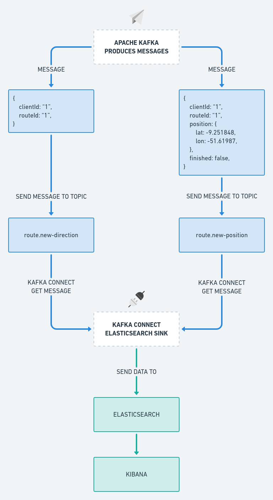

# Code Delivery


Essa aplicação simula o trajeto de uma entrega que vai do ponto A para um ponto B, e para essa simulação funcionar a comunicação é feita em tempo real, após iniciar uma corrida o Frontend da aplicação envia a rota que deseja obter o percurso para a API, e essa API solicita as posições para um Microserviço, esse Microserviço processa cada posição que será preciso para completar o percurso, e envia para a API de 500 em 500ms e essa API envia essa posição para o Frontend, com isso é possível ver o carro que iniciou a entrega se mover, devido a posição que foi enviada.

https://user-images.githubusercontent.com/22561893/156941609-0b9057e7-2204-475d-bc26-c6e0e9718462.mp4

## :rocket: Tecnologias

- [x] [Node.js](https://nodejs.org)
- [x] [Next.js](https://nextjs.org)
- [x] [Material UI](https://mui.com)
- [x] [WebSocket - Socket.io](https://socket.io)
- [x] [TypeScript](https://www.typescriptlang.org)
- [x] [MongoDB](https://mongodb.com)
- [x] [Mongo Express](https://github.com/mongo-express/mongo-express)
- [x] [Apache Kafka](https://kafka.apache.org)
- [x] [Kafka Connect](https://kafka.apache.org/documentation/#connect)
- [x] [Elasticsearch](https://elastic.co)
- [x] [Kibana](https://elastic.co/kibana)

## Fluxo da aplicação

Nesse fluxo é apresentado as etapas de execução e a comunicação entre os sistemas.

Existem 3 sistemas o `Frontend`, a `API` e o `Microserviço` que é o simulador, esses sistemas conversam entre si, o Frontend e a API conversam por meio do WebSocket utilizando o SocketIO, e a API e o Microserviço conversam por meio de tópicos utilizando o Apache Kafka, onde ocorre a produção de uma mensagem e o consumo da mesma.

Para entender o fluxo abaixo é bem simples, comece pelo sistema do **Frontend** e inicie pela **linha azul**, depois é só seguir as setas que você chegará a execução final.

Basicamente a linha azul podemos considerar que é o fluxo da requisição/solicitação, e a linha verde é o fluxo da resposta/conslusão até o cliente final.


## Fluxo de operação do Kafka Connect

O Kafka Connect é usado nesse sistema para obtermos as informações que foram produzidas nos tópicos do Kafka, é utilizado um **conector do tipo sink** que fica obtendo as mensagens produzidas nesses tópicos e manda elas para o **Elasticsearch**, e com essas informações obtidas utilizamos o **Kibana** para criar Dashboards, entre outras coisas que da para fazer.



Conseguimos criar Dashboards como essa por exemplo:


Essa Dashboard é bem simples, o propósito foi utilizar das informações que foram obtidas pelo Kafka Connect e mostrar alguns indicadores com base nisso.

<details>
<summary>Configurando ambiente</summary>

## Configurando ambiente

É necessário efetuar algumas configurações, para quando for iniciar o ambiente ele subir corretamente.

Todas as aplicações estão rodando com a utilização do [Docker](https://docker.com) e [Docker Compose](https://docs.docker.com/compose) então é necessário ter essas ferramentas instaladas em seu sistema.

Um outro ponto importante é que os ambientes estão separados por responsabilidade, por exemplo, tudo que é relacionado ao Apache Kafka e Elasticsearch está dentro de sua respectiva pasta, mas esses ambientes precisam se comunicar entre si, e uma excelente forma de fazer isso é usar o recurso `extra_hosts` do Docker, pois eles não estão dentro de um mesmo arquivo `docker-compose.yaml`, e sim separados.

Os containers necessários estão todos configurados com esse recurso, mas seu sistema precisa ter uma configuração adicional dentro de `/etc/hosts` com o seguinte conteúdo:

```text
127.0.0.1 host.docker.internal
```

Após efetuar essa configuração, reinicie seu sistema.

### API

O arquivo `.env.example` já está preenchido corretamente para o uso, basta copiá-lo:

```bash
$ cd api
$ cp .env.example .env
```

### Frontend

O arquivo `.env.local.example` está quase completo, falta preencher a variável `NEXT_PUBLIC_GOOGLE_API_KEY`

Esse projeto utiliza na parte de mapas o Google Maps, e para utilizar esse mapa é necessário obter uma API Key que precisamos gerar no GCP (Google Cloud Platform).

**1º** Acesse a GPC: https://console.cloud.google.com

**2º** Ative os serviços necessários

Acesse `APIs e serviços` → `Painel` → clique na opção `ATIVAR APIS E SERVIÇOS`

Você deve ativar 2 serviços

- Maps JavaScript API
- Directions API


> **OBS:** a API de mapas do Google não é gratuito, você precisa ativar seu teste gratuito, e com isso você ganha US$ 300,00 para gastar com os serviços da plataforma, mas fique tranquilo após acabar os créditos você não será cobrado, os serviços param de funcionar, até você ativar sua conta para uma normal.

**3º** Gerando credenciais

Após ter ativado os 2 serviços no passo anterior, é necessário gerar a API key.

Acesse `APIs e serviços` → `Credenciais` → `+ Criar Credenciais` → `Chave de API`

Pronto, agora basta copiar o valor da chave que foi gerado, e adicionar na variável de ambiente `NEXT_PUBLIC_GOOGLE_API_KEY`:

```bash
$ cd frontend
$ cp .env.local.example .env.local
```
</details>


<details>
<summary>Executando aplicações</summary>

## Executando aplicações

Abaixo segue as instruções para rodar todas as aplicações:

### Apache Kafka

O ambiente do Apache Kafka irá subir o próprio **Apache Kafka** junto com o **Kafka Connect**, **Zookeeper**, **Kafka Topics Generator** e **Control Center**.

```bash
$ cd apache-kafka
$ docker-compose up -d
```

### Elasticsearch

O ambiente do Elasticsearch irá subir o próprio **Elasticsearch** e também o **Kibana**.

```bash
$ cd elastic-stack
$ docker-compose up -d
```

> **OBS:** possivelmente o container do Elasticsearch pode retornar algum erro, verifique a sessão que foi feita nessa documentação exclusivamente para tratar esse problema.

### API

O ambiente da API irá subir o **Node.js** para iniciar o servidor, **MongoDB** e **Mongo Express**.

```bash
$ cd api
$ docker-compose up -d
```

### Microserviço

O ambiente do Microserviço irá subir somente o **Node.js**.

```bash
$ cd simulator
$ docker-compose up -d
```

### Frontend

O ambiente do Frontend irá subir o Node.js para iniciar o servidor do Next.js e executar a aplicação.

```bash
$ cd frontend
$ docker-compose up -d
```
</details>


<details>
<summary>Solucionando problemas no Elasticsearch</summary>

## Solucionar problemas no Elasticsearch

Se o container Elasticsearch não iniciar, a primeira coisa que você precisa fazer é examinar os logs:

```bash
$ docker logs es01 -f
```

Se o erro for:

> Caused by: java.nio.file.AccessDeniedException: /usr/share/elasticsearch/data/nodes

Este erro ocorre por falta de permissão na pasta onde o volume do Elasticsearch está concentrado, existem duas formas de resolver, siga as soluções abaixo:

**1º** Alterando as permissões da pasta `es01` que está na sua máquina normal, essa pasta é gerada na tentativa de executar o container Elasticsearch:

```bash
$ sudo chown -R 1000:1000 es01
$ docker start es01
```

**2º** Mudando as permissões da pasta `/usr/share/elasticsearch/data` que está dentro do container do Elasticsearch, mas há um problema, o container não consegue ficar UP por muito tempo então você precisa executar os comandos rapidamente:

```bash
$ docker start es01 && docker exec -it es01 /bin/bash

# Dentro do container execute:
$ cd /
$ chown -R 1000:1000 /usr/share/elasticsearch/data
```

Se o erro for:

> es01 exited with code 78

> bootstrap check failure [1] of [1]: max virtual memory areas vm.max_map_count [65530] is too low, increase to at least [262144]

Executar o comando abaixo em seu sistema normal:

```bash
$ sudo sysctl -w vm.max_map_count=262144
$ docker start es01
```
</details>


<details>
<summary>Configurando Kafka Connect + Elasticsearch + Kibana</summary>

## Configurando Kafka Connect + Elasticsearch + Kibana

Esse procedimento é opcional, mas com ele você será capaz de utilizar o Elasticsearch e Kibana para utilizar os dados recebidos em uma Dashboard que você poderá criar.

Para fazer a integração com o Kafka Connect, precisamos adicionar o conector do Elasticsearch, que já está todo configurado e localizado em `apache-kafka/connectors/elastisearch.properties`, por esse conector ser do tipo `sink` os dados obtidos dos tópicos `route.new-direction` e `route.new-position` vão ser enviados para o Elasticsearch.

### Adicionando conector

**1º** Certifique-se que o ambiente do Apache Kafka e todos os outros estejam rodando.

**2º** Acesse o Controle Center pelo endereço: http://localhost:9021
  - 2.1 - Clique em **controlcenter.cluster**
  - 2.2 - Clique em **Connect**
  - 2.3 - Clique em **connect-default**
  - 2.4 - Clique em **Add connector**
  - 2.5 - Clique em **Upload connector config file** e selecione o connector do Elasticsearch que está em `apache-kafka/connectors/elastisearch.properties`
  - 2.6 - Clique em **Continue**
  - 2.7 - Clique em **Launch**

Se tudo der certo, o conector irá ficar **Running**

### Criando Mappings no Kibana

**1º** Acesse o Kibana pelo endereço: http://localhost:5601
  - 1.1 - Clique em **Explore on my own**

**2º** Expanda o menu lateral, e acesse: `Management` → `Dev Tools`

Cole esse mapping abaixo, para o tópico `route.new-direction` e clique em um botão verde para executar essa requisição:

```yaml
PUT route.new-direction
{
  "mappings": {
    "properties": {
      "clientId": {
        "type": "text",
        "fields": {
          "keyword": {
            "type": "keyword"
          }
        }
      },
      "routeId": {
        "type": "text",
        "fields": {
          "keyword": {
            "type": "keyword"
          }
        }
      },
      "timestamp": {
        "type": "date"
      }
    }  
  }
}
```

Agora faça o mesmo para o tópico `route.new-position` com o mapping abaixo:

```yaml
PUT route.new-position
{
  "mappings": {
    "properties": {
      "clientId": {
        "type": "text",
        "fields": {
          "keyword": {
            "type": "keyword"
          }
        }
      },
      "routeId": {
        "type": "text",
        "fields": {
          "keyword": {
            "type": "keyword"
          }
        }
      },
      "position": {
        "type": "geo_point"
      },
      "finished": {
        "type": "boolean"
      },
      "timestamp": {
        "type": "date"
      }
    }  
  }
}
```

Se retornar o status 200 - OK então a requisição foi efetuada com sucesso.

### Criando Index Patterns

**1º** No Kibana expanda o menu lateral, e acesse: `Management` → `Stack Management`
  - 1.1 - Na sessão do Kibana clique em **Index Patterns**

**2º** Clique em **Create index pattern**

Você precisa criar 2 Index Patterns, um para o tópico **route.new-direction** e outro para **route.new-position**

No campo **Name** coloque o nome do tópico que está criando, e no campo **Timestamp field** selecione **timestamp**

Após isso basta clicar em **Create index pattern**

### Considerações finais

Bom nesse momento você está com tudo configurado corretamente, agora basta explorar os recursos do Kibana, você pode expandir o menu lateral acessar a sessão de `Analytics` → `Discover`, pode também criar visualizações em `Analytics` → `Visualize Library` etc.
</details>
